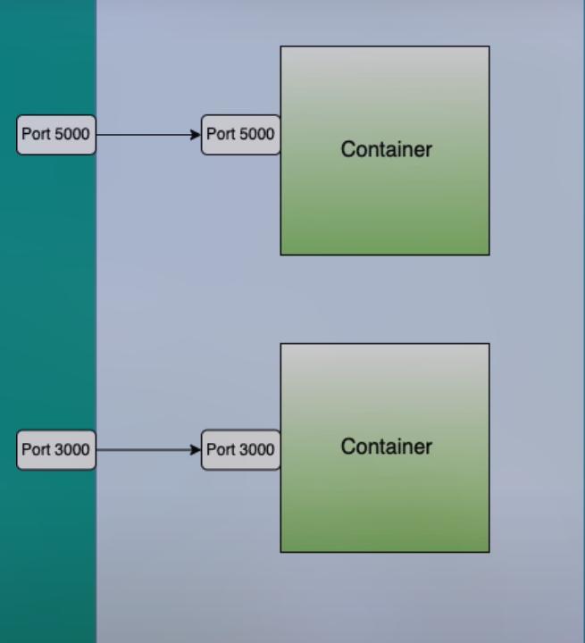

- 
- {:height 34, :width 593}
- On the above example `CONTAINER port` is running on `6379` port but it doesn't made any binding between `HOST port` which mean container is basically `unreachable` by any application.
- using `-p <Host:Container>` for binding Host -> Container.
- ```
  docker run --name postgres-db -p 5000:5432 -d postgres
  # Run a container name: postgres-db
  # Binding: port 5000 on host -> port 5432 on container
  ```