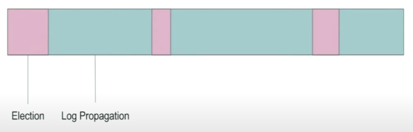
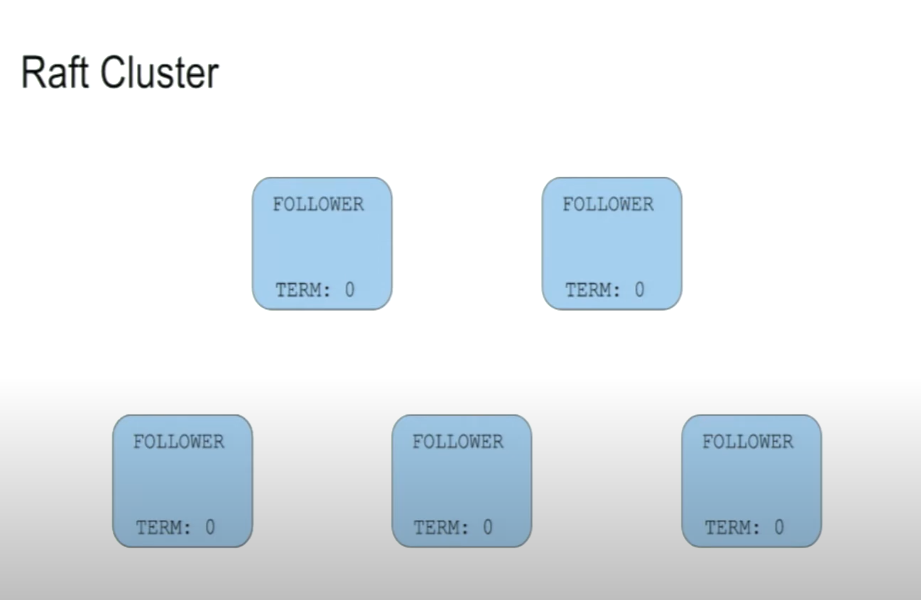
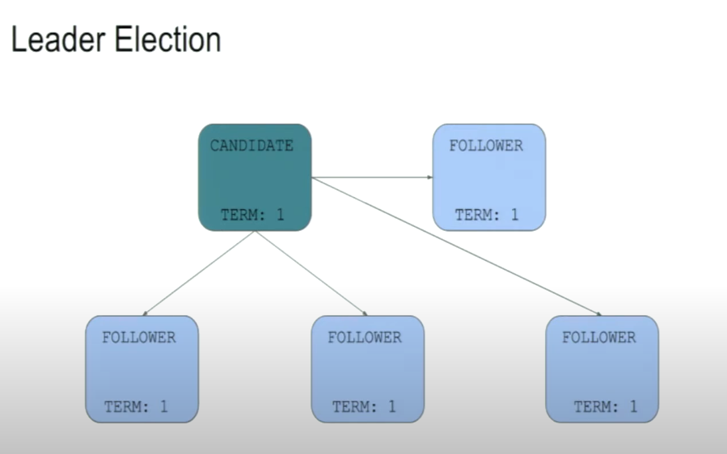
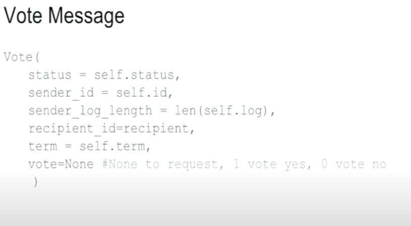
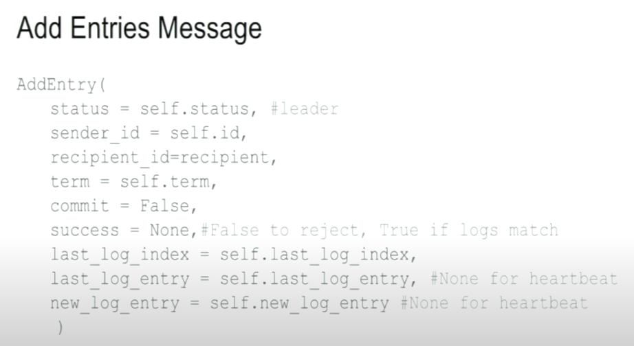

# Problem
collapsed:: true
	- Unreliable network
	  logseq.order-list-type:: number
	- Computers prone to failure
	  logseq.order-list-type:: number
	- Availability
	  logseq.order-list-type:: number
	- How to avoid involving people when things fail.
	  logseq.order-list-type:: number
- # Effective Consensus Algorithms
  collapsed:: true
	- Consistency between participant state machines
	  logseq.order-list-type:: number
	- Tolerant of failure of 1 or more participant.
	  logseq.order-list-type:: number
	- Tolerant of unreliable networks and network partition
	  logseq.order-list-type:: number
- # Features of Consensus Algorithms
  collapsed:: true
	- Agreement 
	  logseq.order-list-type:: number
	- Validity
	  logseq.order-list-type:: number
	- Termination
	  logseq.order-list-type:: number
- # Terms
  collapsed:: true
	- Leader
	  logseq.order-list-type:: number
	- Follower
	  logseq.order-list-type:: number
	- Client
	  logseq.order-list-type:: number
	- Log
	  logseq.order-list-type:: number
	- Leader accept data from the client -> Leader send data to it followers -> And in each participant the log store it act as the state machine and it aim to have the logs match.
	- Election and Log Propagation
		- Asynchronous -> No bounds on message response and received.
		  logseq.order-list-type:: number
		- Leader server until it die and trigger a new Election phrase.
		  logseq.order-list-type:: number
		- Cluster do not accept data during the Election phrase.
		  logseq.order-list-type:: number
		- 
		  logseq.order-list-type:: number
- # How raft consensus perform
  collapsed:: true
	- **`Prerequisite`**
		- **Term increase circumstances**
		  logseq.order-list-type:: number
		  collapsed:: true
			- *`Election Timeout:`* When a follower's election timeout expires, and it transitions to the candidate state, it immediately increments its current term number. This new, higher term number is included in the RequestVote RPCs it sends to other nodes to solicit votes.
			  logseq.order-list-type:: number
			- *`Receiving a Higher Term:`*If a node (whether a follower, candidate, or leader) receives a message from another node with a term number *higher* than its own, it immediately updates its current term to match the higher term. This ensures that all nodes eventually converge on the same term number, which is essential for maintaining consistency. This can happen when:
			  logseq.order-list-type:: number
				- A follower receives a RequestVote RPC with a higher term.
				- A candidate receives a RequestVote response or an AppendEntries RPC with a higher term.
				- A leader receives an Append Entries response with a higher term
		- **Raft specific criteria on voting**
		  logseq.order-list-type:: number
		  collapsed:: true
			- *`Term Number:`* Candidate's term number >= Voter's current term.
			  logseq.order-list-type:: number
			- *`Log Completeness (Up-to-date logs):`* The voter checks if the candidate's log is at least as up-to-date as its own. Raft uses a simple mechanism to determine log completeness:
			  logseq.order-list-type:: number
				- The voter compares the index and term of the last entry in its log with the corresponding values in the candidate's log.
				- If the candidate's log has a later term number in its last entry, it's considered more up-to-date.
				- If the term numbers are the same, the longer log is considered more up-to-date.
				  If the candidate's log is not at least as complete, the vote is rejected. This ensures that more complete logs are prioritized.
			- *`Prior Vote in Term:`* The voter must not have already voted for another candidate in the current term. If it has, it rejects the vote request. This prevents a node from voting for multiple candidates in the same term, which could lead to a split vote.
			  logseq.order-list-type:: number
		- **Leader is the only one who accept data from the client**
		  logseq.order-list-type:: number
	- Start as followers
	  logseq.order-list-type:: number
	  collapsed:: true
		- 
	- Start Election phrase
	  logseq.order-list-type:: number
	  collapsed:: true
		- Each follower will have a random election timeout, to prevent all of the follower turn into a candidate at the same time. And when followers do not receive any heartbeat from leader node within its election of time, it transitions to the candidate state, Increase it current term number, vote for itself. Sends `RequestVote` RPCs to all order node in a cluster.
		- And if Candidate receives vote from majority of the cluster. It become a new leader. Otherwise, it will remain candidate and continue to election process.
		- 
	- Log Replication
	  logseq.order-list-type:: number
	  collapsed:: true
		- Leader is the `only` one participation that can accept data form `the client`. if the follower hear from the client they redirect to the last leader that they hear from.
		- Leader propose a log entry to it followers and follower vote to accept the entry, if a majority of followers accept the entry then leader mark that entry as committed and notify to other follower that they should also commit the log entry.
		- When log entry is committed, each manager node (including the leader) apply the corresponding change to its local state machine (database).
		- And then continue replication process to sync all the node together.
		- Sample:
			- **Scenario:**
				- 5-node cluster (1 leader, 4 followers).
				- Log entry X is proposed.
				- 3 followers (including the leader itself) accept X.
				- Follower F4 rejects X or is unavailable during the voting process.
			- **Recovery Process:**
				- **Log Replication Continues:** The leader commits log entry X and continues appending subsequent entries to the log (e.g., Y, Z). The leader replicates these entries to the accepting followers.
				- **Heartbeat/Log Consistency Check:** The leader periodically sends heartbeats to all followers (including F4). These heartbeats often include information about the leader's current log state (e.g., the index and term of the latest committed entry). Alternatively, some systems have explicit log consistency checks.
					- Remember that this process is not a part of Log replication process and independently from the client request, it just a process of leader to periodically sends heartbeats (empty AppendEntries RPCs) to followers.
					- The consistency check (using `prevLogIndex` and `prevLogTerm`) is *part* of *every* AppendEntries RPC, including those that carry new log entries and those that are just heartbeats. This mechanism detects and corrects log inconsistencies.
				- **Discrepancy Detection:** F4 receives a heartbeat or performs a consistency check, revealing that its log is behind. It detects that it is missing entry X (and potentially Y, Z).
				- **Log Fetching:** F4 requests the missing log entries from the leader. This can be done by specifying the index of the last entry it has. The leader sends the missing entries (X, Y, Z) to F4.
				- **Log Application:** F4 appends the received log entries (X, Y, Z) to its own log. It then applies the corresponding operations to its local database state.
				- **Synchronization Achieved:** F4 is now up-to-date and consistent with the rest of the cluster. It resumes normal operation, receiving and applying new log entries as they are committed.
- # How Vote message look like
  collapsed:: true
	- 
- # How entries message look like
  collapsed:: true
	- 
- # Problem with even number of node in consensus
  collapsed:: true
	- **Leader Loses Connection:** If the leader (node 1) loses connection with *only* node 2, the leader *remains* part of the cluster. It still has a connection to nodes 3 and 4. A majority of the cluster (3 out of 4 nodes) can still communicate. Node 1 will continue to function as the leader, albeit with reduced redundancy. Nodes 3 and 4 will continue to receive heartbeats from node 1 and consider it the leader.
	- **Leader Isolated:** If the leader (node 1) loses connection with *both* nodes 2 *and* 3 (or 2 *and* 4), then it becomes isolated. The remaining nodes (2, 3, and 4, or 2, 4, and 3) constitute a majority and will hold a new election.
	- **New Election:** The followers (2, 3, and 4 in the isolation scenario) will time out because they are no longer receiving heartbeats from node 1. They will transition to candidates, increment their term numbers, and request votes. One of them will win the election (assuming no split votes) and become the new leader.
	- **Old Leader Recovers:** When node 1 recovers and rejoins the cluster, it will notice that the other nodes have a higher term number than itself. This immediately indicates that it is no longer the leader. Node 1 will revert to a follower state, update its term number to match the cluster, and begin receiving log entries and heartbeats from the new leader.
	  
	  **Key Points:**
	- **Majority Matters:** Raft operates based on majorities. As long as the leader can communicate with a majority of the cluster, it remains the leader. The loss of a single follower doesn't trigger a new election unless it isolates the leader from a majority.
	- **Term Numbers:** Term numbers are essential for Raft's operation. They provide a mechanism to identify stale information and ensure that only one leader is active at a time. A node with a lower term number always defers to a node with a higher term number.
	- ```
	  # Majority means more than a half of the voting nodes in cluster
	  # A candidate must receive votes from a majority of the cluster's voting members to become the leader.
	  If the leader retains a majority, it remains the leader. If it loses its majority, a new election is triggered.
	  ```
- # Edge case
	- **Split vote**
	  logseq.order-list-type:: number
	- [[Split-Brain (Network partitions)]]
	  logseq.order-list-type:: number