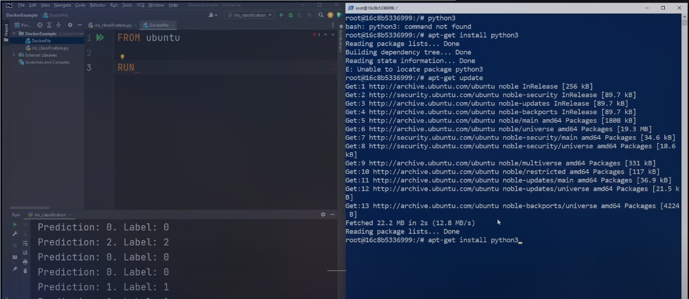

# What is a container
	- A way to package application with all the necessary dependencies and configuration
		- ```
		  npm run dev -> npm install -> ...etc
		  ```
	- Portable artifact easily shared and moved around
	- Make development and deployment more efficient
	- {:height 334, :width 748}
- # Where do containers live?
  collapsed:: true
	- Container repository
	- Private or Public -> Company create a repository to store their containers
	- Docker hub (Public repository for docker)
- # Why we need container
  collapsed:: true
	- ## Development Process
		- ## Before containers
			- Need to install the application specific version
			- Installation process different on each OS environments.
			- Need to run multiple CLI to install -> chance of something going wrong is `HIGH`
		- ## After containers
			- Packaged with all needed configuration.
			- One command to install application.
	- ## Deployment Process
		- ## Before containers
			- `Textual guide` of deployment -> Developer can `miss to mention` important point about configration -> Operations team have to go back to developers and ask for in4.
			- Configuration on server needed
			- External dependencies on the server OS.
		- ## After containers
			- Dev and Ops work together to package the application in a container.
			- No environmental configration needed on server - except for docker runtime to run the docker container.
-