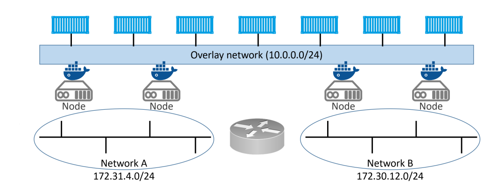

# Docker swarm is all about two things:
collapsed:: true
	- An docker enterprise-grade secure cluster of Docker hosts.
	  logseq.order-list-type:: number
	- An engine for orchestrating microservice app.
	  logseq.order-list-type:: number
	- Docker Swarm exposes API that allow us to deploy and manage complex microservices apps with ease. Can perform rolling update, rollbacks, and scaling operations. Again all with simple command.
	- Swarm mode consider for deployment, so that if your purpose is not for deploy using docker compose instead.
- # Docker Swarm the deep dive
  collapsed:: true
	- ## **Swarm primer**
	  collapsed:: true
		- swarm consist of one or more Docker nodes. It can be physical servers, VMs, cloud instances.
		- Nodes are configured as managers or workers, Managers are dispatching tasks to workers and workers will execute them.
		- The configuration and state of swarm is held in a distributed `etcd` database located on all managers. Its kept in memory and up-to-date. But swarm will do it under the hood with `zero` configuration.
		- About the security, Swarm use TLS to encrypt communications, authenticate nodes, and authorize roles.
	- ## **Build a secure swarm cluster**
	  collapsed:: true
		- On the networking front, we need the following ports open on routers and firewalls between nodes:
			- 2377/tcp: for secure client-to-swarm communication
			- 7946/tcp and udp: for control plane gossip
			- 4789/udp: for VXLAN-based overlay networks
		- **`Note`**: Docker desktop on windows only support to run single instance of node.
		- The process of building:
			- Docker nodes when they are not added into swarm are said to be in a single-engine mode. It only switch to swarm mode when they are added to a swarm.
			- Running `docker swarm init` on Docker host in a single-engine nodes will switch that node into  a swarm mode, create new swarm and make the first node manager of the swarm.
			- Addition join to a swarm can we workers or managers node.
			- Step-by-step:
			  collapsed:: true
				- **First log on to your mgr1 and init a new swarm**
				  logseq.order-list-type:: number
					- ```
					  docker swarm init \
					  --advertise-addr 10.0.0.1:2377 \
					  --listen-addr 10.0.0.1:2377
					  ```
					- `docker swarm init`: This tell docker to init a new swarm and make this node the first manager
					- `--advertise-addr 10.0.0.1:2377`: as the name suggests, this is the swarm API enpoint that advertise other node in the swarm. It just only one of the node's IP addresses, but can be use as external load-balancer address.
					- `--listen-addr 10.0.0.1:2377`: this is the IP address that the node will accept swarm traffic on. If not explicity set, it defaults to the same value as `--advertise-addr`. But if your `--advertise-addr` place a role as load-balancer you must use `--listen-addr` to specify a local IP or interface for swarm traffic.
					- so the best practices is about using both instead just only one `--advertise-addr` for scaling on the future.
					- Default port for swarm operation is `2377`. This is customizable, but its a best practice to use 2377/tcp for secured (HTTPS) communicate between the client-to-swarm.
				- **List the nodes in the swarm**
				  logseq.order-list-type:: number
					- ```
					  docker node ls
					  ```
					- we will see that `mgr1` is the only one node that exist in the list as a Leader.
				- **Using `docker join-token worker` and `docker join-token manager`**
				  logseq.order-list-type:: number
					- `join-token` command use for extracting the commands and tokens request required to add new `worker` or `manager`.
					- ```
					  # Generate commands and token for join a node to swarm as manager
					  docker swarm join-token manager
					  
					  #Generate commands and token for join a node to swarm as worker
					  docker swarm join-token worker
					  ```
				- logseq.order-list-type:: number
		- ## **Swarm manager high availability (HA)**
		  collapsed:: true
			- Swarm managers have native support for high availability (HA). This mean one or more can fail and the survivors, will keep the swarm running. (Active-Passive multi-manager HA).
				- We can have multiple of swarm managers but only one of them is active at given moment. This active called `leader`, and the leader is the only one that will take the request from the client. If `manager in passive` mode take request from client, it proxies them across to the `leader`.
			- 
			- From that image we can see that a `manager` can be a `leader` or `followers (passive manager)`.
			- **`Best practice`**:
				- Deploy an odd number of manager.
				  logseq.order-list-type:: number
				- Don't deploy too many managers (3 or 5 is recommended)
				  logseq.order-list-type:: number
			- Having odd number of managers reduces the chance of [[Split-Brain (Network partitions)]] conditions.
	- ## Swarm services
		- Swarm services provide most of familiar container options, such as *name*, *port mapping*, *attaching to network*, and *images*.  But they add important cloud-native features, including *desired state* and *automatic reconciliation*.
		- We can create service in one of two ways:
			- Imperatively on the command line with `docker service create`
			  logseq.order-list-type:: number
			- Declaratively with a stack file. [[Docker stack]]
			  logseq.order-list-type:: number
		- **`Example`**:
		- Assume you have an app with a web front-end. You have an `image` for the web server, and testing has shown that you need `5 instances` to handle normal daily traffic. You translate this requirement into a `single service` declaring the image to use, and that the service should always have 5 running replicas. You issue that to the swarm as your `desired state`, and the swarm takes care of ensuring there are always
		  5 instances of the web server running.
		- ```
		  docker service create --name web-fe \
		  -p 8080:8080 \
		  --replicas 5 \
		  nigelpoulton/pluralsight-docker-ci
		  ```
		- **How's the command work?**
			- We used `docker service create` to tell docker we create a new service with the name `web-fe` by using `--name flag`.
			- Map port `8080` on every `node` in the swarm to `8080` inside of `each service` replica.
			- `--replicas flag` use to tell Docker there should always be 5 replicas of this service.
			- On the last step we specify the image that service should use so that all services replicas using the same`image and config` .
		- **View and inspect service**
			- ```
			  # List all service running on the swarm
			  docker service ls
			  
			  # Inspecting service on node
			  docker service ps web-fe
			  
			  # Service's configuration, status, and deployed tasks
			  docker service inspect --pretty web-fe
			  ```
		- ## Scaling service
			- ```
			  docker service scale web-fe=10
			  ```
			- This command will scale the number of service replicas from 5 to 10.
		- # Rolling updates
			- Before deploy a new service create a new overlay network for the service.
			  collapsed:: true
				- ```
				  docker network create -d overlay uber-net
				  ```
			- This example shows four swarm nodes on two underlay network connected by a layer 3 router. The overlay network spans all 4 swarm nodes creating a single flat layer 2 network for containers to use.
			- 
			- **Create a new service and attach it to the network**
			  collapsed:: true
				- ```
				  docker service create --name uber-svc \
				  --network uber-net \
				  -p 80:80 \
				  --replicas 12 \
				  nigelpoulton/tu-demo:v1
				  ```
				- Feel free to point our web browser to other nodes in the swarm. we'll be able to reach the web service from any node because the -p `80:80` flag creates an ***ingress mode*** mapping on every swarm node. This is true even on nodes
				  that are not running a replica for the service - **every node gets a mapping and can therefore redirect your
				  request to a node that is running the service**. [[Routing Mesh and Ingress Network]]
				- ```
				  docker service ccreate --name uber-svc \
				  --network uber-net \
				  --publish published=80,target=80,mode=host \
				  --replicas 12 \
				  nigelpoulton/tu-demo:v1
				  ```
				- Different between `-p` and `--publish`:
				  collapsed:: true
					- |**Feature**|**-p**|**--publish**|
					  |Syntax|Simpler|More explicit|
					  |Protocol|Implicit TCP|Explicit defined|
					  |Port Range|Not supported|Supported|
					  |Common Usage|docker run|docker service create|
					- For simple docker run commands where you're publishing single ports and TCP is implied, -p is often more concise.
					- For docker service create in Swarm mode, --publish is recommended. Its explicit protocol definition and support for port ranges are valuable, especially in more complex Swarm deployments. The more verbose syntax also improves clarity in service definitions.
					- For situations where you need to expose UDP ports, always explicitly specify the protocol, whether using -p or --publish. Using the longhand syntax of --publish is best for clarity in this case.
					-
			- **Update running service**
				- ```
				  docker service update \
				  --image nigelpoulton/tu-demo:v2
				  --update-parallelism 2 \
				  --update-delay 20s uber-svc
				  ```\
				- **How's it work**
					- We choose the image we want to update by using `--image tag`
					- Specified `--update-parallelism` & `--update-delay` flags to make sure that new image was pushed to 2 replicas at a time with a 20 second cool-off period in between each set of two. Finally, it instructs the swarm to make the changes to the uber-svc service.
					-
	- Troubleshooting
	-
- # The commands
- ## Docker Swarm Commands Cheat Sheet
  collapsed:: true
	- **Swarm Management:**
	  collapsed:: true
		- **docker swarm init:** Creates a new Swarm. The node where this command is run becomes the initial manager node.
		- **docker swarm join-token [manager|worker]:** Displays the join command and token for adding manager or worker nodes to an existing Swarm.
		- **docker node ls:** Lists all nodes in the Swarm, including their roles (manager, worker), status, and leadership.
	- **Service Management:**
	  collapsed:: true
		- **docker service create [options] <image>:** Creates a new service. Options include --name, --replicas, -p or --publish for ports, and many others.
		- **docker service ls:** Lists running services and provides basic information about their state and replicas.
		- **docker service ps <service_name>:** Displays detailed information about individual replicas of a service, including their status, node placement, and any errors.
		- **docker service inspect <service_name>:** Shows very detailed information about a service's configuration. Use --pretty for a more concise output.
		- **docker service scale <service_name>=<replicas>:** Scales the number of replicas for a service up or down.
		- **docker service update [options] <service_name>:** Updates various properties of a running service, such as the image, environment variables, or resource limits.
		- **docker service logs <service_name>:** View the logs of a service. Options like -f (follow) and filters are available.
		- **docker service rm <service_name>:** **Caution:** Deletes a service and all its replicas *without* confirmation.
- [[Scenario of replicas and node]]