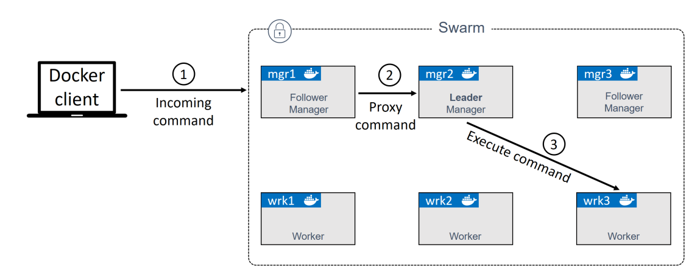

# Docker swarm is all about two things:
	- An docker enterprise-grade secure cluster of Docker hosts.
	  logseq.order-list-type:: number
	- An engine for orchestrating microservice app.
	  logseq.order-list-type:: number
	- Docker Swarm exposes API that allow us to deploy and manage complex microservices apps with ease. Can perform rolling update, rollbacks, and scaling operations. Again all with simple command.
	- Swarm mode consider for deployment, so that if your purpose is not for deploy using docker compose instead.
- # Docker Swarm the deep dive
	- ## **Swarm primer**
		- swarm consist of one or more Docker nodes. It can be physical servers, VMs, cloud instances.
		- Nodes are configured as managers or workers, Managers are dispatching tasks to workers and workers will execute them.
		- The configuration and state of swarm is held in a distributed `etcd` database located on all managers. Its kept in memory and up-to-date. But swarm will do it under the hood with `zero` configuration.
		- About the security, Swarm use TLS to encrypt communications, authenticate nodes, and authorize roles.
	- ## **Build a secure swarm cluster**
		- On the networking front, we need the following ports open on routers and firewalls between nodes:
			- 2377/tcp: for secure client-to-swarm communication
			- 7946/tcp and udp: for control plane gossip
			- 4789/udp: for VXLAN-based overlay networks
		- **`Note`**: Docker desktop on windows only support to run single instance of node.
		- The process of building:
			- Docker nodes when they are not added into swarm are said to be in a single-engine mode. It only switch to swarm mode when they are added to a swarm.
			- Running `docker swarm init` on Docker host in a single-engine nodes will switch that node into  a swarm mode, create new swarm and make the first node manager of the swarm.
			- Addition join to a swarm can we workers or managers node.
			- Step-by-step:
			  collapsed:: true
				- **First log on to your mgr1 and init a new swarm**
				  logseq.order-list-type:: number
					- ```
					  docker swarm init \
					  --advertise-addr 10.0.0.1:2377 \
					  --listen-addr 10.0.0.1:2377
					  ```
					- `docker swarm init`: This tell docker to init a new swarm and make this node the first manager
					- `--advertise-addr 10.0.0.1:2377`: as the name suggests, this is the swarm API enpoint that advertise other node in the swarm. It just only one of the node's IP addresses, but can be use as external load-balancer address.
					- `--listen-addr 10.0.0.1:2377`: this is the IP address that the node will accept swarm traffic on. If not explicity set, it defaults to the same value as `--advertise-addr`. But if your `--advertise-addr` place a role as load-balancer you must use `--listen-addr` to specify a local IP or interface for swarm traffic.
					- so the best practices is about using both instead just only one `--advertise-addr` for scaling on the future.
					- Default port for swarm operation is `2377`. This is customizable, but its a best practice to use 2377/tcp for secured (HTTPS) communicate between the client-to-swarm.
				- **List the nodes in the swarm**
				  logseq.order-list-type:: number
					- ```
					  docker node ls
					  ```
					- we will see that `mgr1` is the only one node that exist in the list as a Leader.
				- **Using `docker join-token worker` and `docker join-token manager`**
				  logseq.order-list-type:: number
					- `join-token` command use for extracting the commands and tokens request required to add new `worker` or `manager`.
					- ```
					  # Generate commands and token for join a node to swarm as manager
					  docker swarm join-token manager
					  
					  #Generate commands and token for join a node to swarm as worker
					  docker swarm join-token worker
					  ```
				- logseq.order-list-type:: number
		- ## **Swarm manager high availability (HA)**
			- Swarm managers have native support for high availability (HA). This mean one or more can fail and the survivors, will keep the swarm running. (Active-Passive multi-manager HA).
				- We can have multiple of swarm managers but only one of them is active at given moment. This active called `leader`, and the leader is the only one that will take the request from the client. If `manager in passive` mode take request from client, it proxies them across to the `leader`.
			- 
			- From that image we can see that a `manager` can be a `leader` or `followers (passive manager)`.
			- **`Best practice`**:
				- Deploy an odd number of manager.
				  logseq.order-list-type:: number
				- Don't deploy too many managers (3 or 5 is recommended)
				  logseq.order-list-type:: number
			- Having number of managers reduces the chance of [[Split-Brain]] conditions.
	- Deploy some swarm services
	- Troubleshooting
-