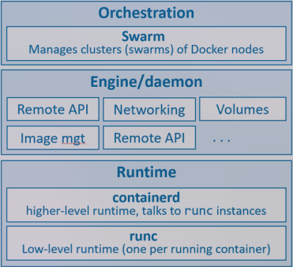
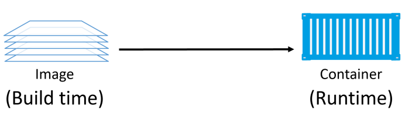
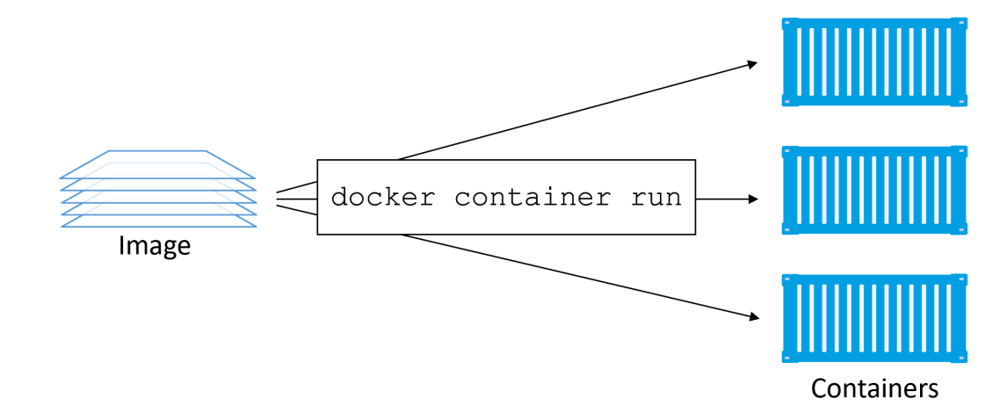
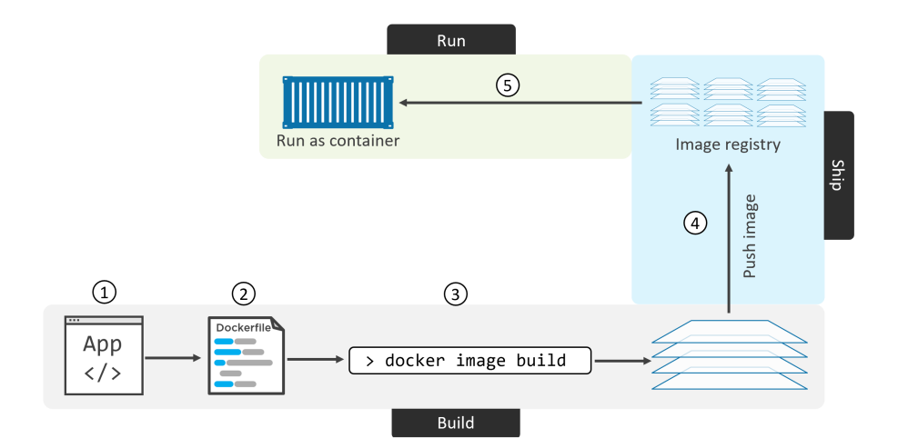

# At least three things to be aware of when referring to Docker as a technology:
	- The runtime - Responsible for starting and stopping containers building all OS construct such as namespace and cgroups [[Runc]].
	  logseq.order-list-type:: number
	- [[The daemon (a.k.a engine)]] - Docker daemon (dockerd) sits above containerd and performs higher-level task such as: Docker remote api, managing images, managing volumes, managing networks, etc...Major job of the docker daemon is provide an easy-to-use standard inteface that abstracts the lower levels.
	  logseq.order-list-type:: number
	- The orchestrator - Docker can native support for manageing clusters of nodes running Docker. These clusters are calling swarm and the native technology is called Docker Swarm
	  logseq.order-list-type:: number
	- 
	  logseq.order-list-type:: number
- # Images
  collapsed:: true
	- ## The basic
		- A docker image is a unit of packaging that contains everything required for an application to run includes: [[Container vs Image]]
			- Application code
			  logseq.order-list-type:: number
			- Application depedencies
			  logseq.order-list-type:: number
			- OS constructs
			  logseq.order-list-type:: number
	- ## The deep dive
		- We can think of images are stopped containers - container that's not running (or classes). So image like a *`build-time`* construct and container like a *`run-time`* constructs.
		- 
		- Remember that all images does not a kernel - all containers running on a Docker host share access to the host's kernel.
- # Container
	- Container is a runtime instance of an image.
	- 
- # Development process
	- 
- [[Container Concept]]
- [[Container technique]]
- [[Container vs Image]]
- [[CONTAINER port vs HOST port]]
- [[CLI]]
- [[Debug]]
- [[Docker vs Virtual Machine]]
- [[Docker vs Kubernetes]]
- [[Docker Swarm]]
- ## Low-level
	- [[OCI (Open Container Initiative)]]
	- [[Namespace]]
	- [[Runc]]
	- [[libcontainer]]
	- {{embed ((6755e52b-fd4f-48f3-b8c0-014cc6731d25))}}
	- [[The daemon (a.k.a engine)]]
	- [[OCI layer]]
	-
- ## Sample config
  collapsed:: true
	- postgres - pgadmin4
	  collapsed:: true
		- ```
		  services:
		    postgres:
		      container_name: postgres-db
		      image: postgres
		      environment:
		        POSTGRES_USER: postgres
		        POSTGRES_PASSWORD: 12345
		        PGDATA: /data/postgres
		      volumes:
		        - postgres:/var/lib/postgresql/data
		      ports:
		        - 5432:5432
		      networks:
		        - postgres
		      restart: unless-stopped
		    
		    pgadmin:
		      container_name: postgres-db-gui
		      image: dpage/pgadmin4
		      environment:
		        PGADMIN_DEFAULT_EMAIL: admin@gmail.com
		        PGADMIN_DEFAULT_PASSWORD: admin
		        PGADMIN_CONFIG_SERVER_MODE: 'False'
		      volumes:
		        - pgadmin:/var/lib/pgadmin
		      ports:
		        - 5050:80
		      networks:
		        - postgres
		      restart: unless-stopped
		  networks:
		    postgres:
		      driver: bridge
		  volumes:
		    postgres:
		    pgadmin:
		  ```
		- pgadmin: localhost:5050
			- port: postgres
				- USERNAME: admin@gmail.com
				- PASSWORD: admin
		- postgrest: localhost:5432
			- USERNAME: postgres
			- PASSWORD: 12345
	- Vite - ReactTs
		- ```
		  # Stage 1: Build Stage
		  FROM node:23-alpine AS builder
		  
		  WORKDIR /app
		  
		  COPY package.json package-lock.json ./
		  
		  RUN npm install
		  
		  COPY . .
		  
		  RUN npm run build
		  
		  # Stage 2: Production Stage
		  FROM node:23-alpine
		  
		  RUN npm install -g serve
		  
		  WORKDIR /app
		  
		  # Copy only the built files from the builder stage
		  COPY --from=builder /app/dist ./dist
		  
		  EXPOSE 3000
		  
		  CMD ["serve", "-s", "dist"]
		  ```
- ## Best practice
  collapsed:: true
	- Use official Docker images  as Base Image.
	  logseq.order-list-type:: number
	- Use specific image version -> `avoid unpredictable`.
	  logseq.order-list-type:: number
	- Use small-sized official Images (usally from `alpine linux`)
	  logseq.order-list-type:: number
	- Optimize caching iamge layers
	  logseq.order-list-type:: number
		- Docker images are built based on a Dockerfile.
		  logseq.order-list-type:: number
		- Each dockerfile command creates an image layer.
		  logseq.order-list-type:: number
		- When we build a dockerfile we will use some image as a base layer and then our docker file will stack on top of that layer -> pop on top of stack and when the poped layer is not being cache, all the down stream layer are re-created as well.
		  logseq.order-list-type:: number
		- `Tips`: order dockerfile commands from least to most frequently changing
		  logseq.order-list-type:: number
	- Using .dockerignore
	  logseq.order-list-type:: number
	- Apply mutil-stage to minimize the image size.
	  logseq.order-list-type:: number
		- In scenarios where we can run the web application without needing build dependencies (e.g., `React`), you only need a tool to build your application into `HTML` and `JavaScript`. Once built, the application can run without any build tools. In such cases, we can split the Dockerfile into two stages: the `build` stage and the `production` stage. The `build` stage acts as a temporary image used only for building the application, while the `production` stage only includes the final built files and runtime dependencies. This approach minimizes the final image size by removing the intermediate build image, resulting in a smaller and more efficient production image.
		  logseq.order-list-type:: number
	- Use the Least Privileged User
	  logseq.order-list-type:: number
	- Using `docker scan <Image>` for Scanning your images Vulnerabilities.
	  logseq.order-list-type:: number