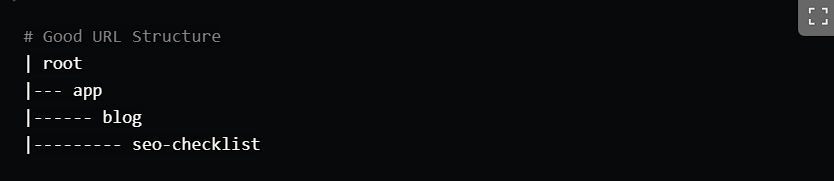
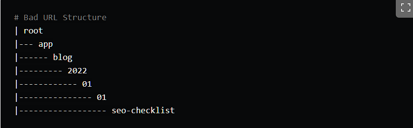

- Optimize meta data
  logseq.order-list-type:: number
  collapsed:: true
	- ```
	  import Head from 'next/head'
	  - //Page route
	  export default function Page() {
	  return (
	    <Head>
	      <title>Page Title</title>
	      <meta name="description" content="Page Description" />
	      <link rel="canonical" href="https://example.com/page" />
	    </Head>
	  )
	  }
	  - //App route
	  export const metadata = {
	  title: 'Page Title',
	  description: 'Page Description',
	  }
	  ```
- URL Structure and Routing
  logseq.order-list-type:: number
  collapsed:: true
	- 
	- 
	-
- Content Optimization
  logseq.order-list-type:: number
	- + Key words:
		- - Long tail: "best running shoes for flat feet".
		  collapsed:: true
			- **Pros:**
			- Lower competition due to their specificity.
			- Higher conversion rates since they target users with clear intent.
			  
			  **Cons:**
			- Lower search volume, which means fewer visitors.
			  
			  Long-tail keywords are critical for targeting users who are ready to make a decision or perform an action, making them essential for driving conversions.
		- - Short tail: "SEO", "shoes".
		  collapsed:: true
			- **Pros:**
			- Large search volume, attracting lots of traffic.
			- Ideal for brand awareness and broad topic coverage.
			  
			  **Cons:**
			- High competition, making it difficult to rank.
			- Low user intent, often resulting in lower conversion rates.
		- - Branded Keywords: "Apple MacBook",  "Nike running shoes".
		  collapsed:: true
			- **Pros:**
			- High conversion potential since users already know the brand.
			- Lower competition for small brands.
			  
			  **Cons:**
			- Limited reach since they only attract users who are already familiar with the brand.
		- - Non-Branded Keyword: "laptop", "running shoes"