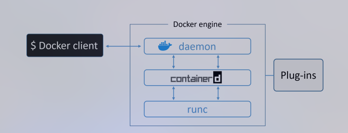
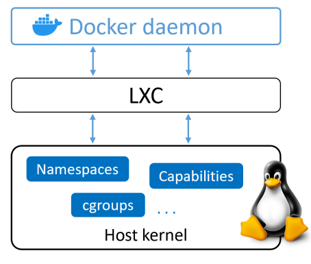
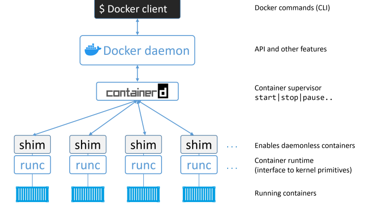
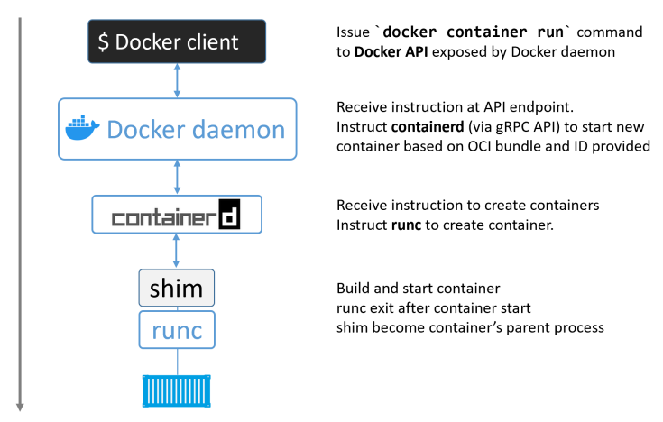
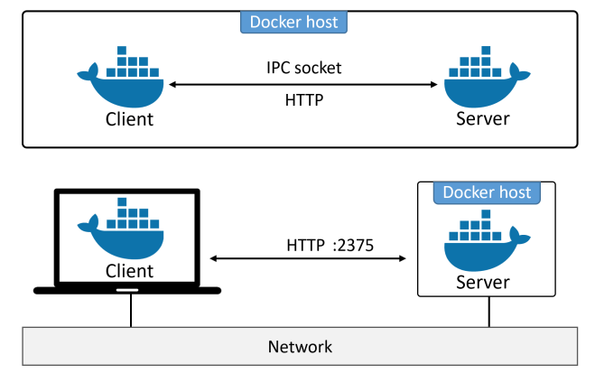

# How docker engine work (High-level view)
	- Docker CLI send commands to Docker deamon (Dockerd) -> Docker daemon parses these commands and delegates lower-level container lifecycle task to containerd -> Containerd, in turn, uses runc to execute the container with proper isolation and configuration on the host OS.
	  logseq.order-list-type:: number
	- {:height 275, :width 697}
	  logseq.order-list-type:: number
- # How docker engine work (Low-level view)
	- When docker first released, the Docker engine had two major components:
		- The Docker daemon (hereafter referred to as just "the deamon").
		  logseq.order-list-type:: number
		- LXC - Act as an abstract layer that simplifies access to linux kernel like namespace and cgroups, etc.. 
		  logseq.order-list-type:: number
		- {:height 393, :width 454}
		  logseq.order-list-type:: number
- # Getting rid of LXC
  id:: 6755c273-e117-46bb-9093-c1a57b17de7e
	- First up, LXC is linux-specific. This could be a problem if project is multi-platform.
	  id:: 6755c288-36c4-4012-8032-63fd4d5a82ed
	- Second up, being depending on external tool which will cause limited on update, change or potential deprecation.
	  id:: 6755c2e5-cd60-401b-9aed-e57355458b24
- # Getting rid of monolithic Docker daemon
	- Overtime, the monolithic nature of the Docker daemon become more and more problematic:
		- It's hard to innovate on.
		  logseq.order-list-type:: number
		- It got slower.
		  logseq.order-list-type:: number
		- It wasn't what the ecosystem wanted.
		  logseq.order-list-type:: number
	- So that, Docker. Inc has breaking and re-factoring the Docker Engine `All` of the `container execution` and `container runtime code` entirely removed from the deamon and  refactored into small, specialized tool.
	- {:height 433, :width 741}
- # The influence of the Open container initiative (OCI)
	- While Docker, Inc. was breaking deamon apart and refactoring code. OCI was in the process of defining two container-related specifications (a.k.a standards):
		- Image spec
		  logseq.order-list-type:: number
		- Container runtime spec
		  logseq.order-list-type:: number
	- Then Docker engine implements the OCI specifications as closely as possible. For example, the Docker deamon no longer contains any container runtime code - all container runtime code is implemented in a separate OCI-compliant layer. By default, Docker uses [[Runc]] for this.
- # Containerd
	- On the trip to strip functionality out of the Docker deamon, all of the container execution logic was ripped out and refactored into a new tool called containerd. Its sole the purpose in life was to manage container lifecycle operation - `start` | `stop` | `pause` | `rm` ...
	- Containerd is available as a deamon for Linux and Windows, and Docker has been using it on Linux. In the Docker engine stack, containerd sits `between` the `deamon` and `runc` at the [[OCI layer]].
	- Over time, it branched out and taken more functionality (image pulls, volumes and networks) that is not approach the original pupose when docker design containerd - Single task in life.
- # Example workflow when starting a new container
	- ```
	  docker container run --name ctrl -it alpine:latest sh
	  ```
	- When you put it on the Docker CLI, it will make an API call with payload and POSTs them to the API Endpoint exposed by the Docker daemon.
	- Once docker daemon receive the command to create container, it make a call to `containerd`. Remember that the daemon no-longer contains any code to create container.
		- The `deamon` communicate with `containerd` via a CRUD-style API over gRPC.
		- Despite its name, remember `containerd` cannot actually create containers. It use `runc` to do that. It converts the required Docker image into an [[OCI bundle]] and tell runc to use this to create  a new container.
	- and then [[Runc]] come into place.
	- 
- # About the shim
  id:: 6755e52b-fd4f-48f3-b8c0-014cc6731d25
	- The shim is integral to the implementation of deamonless containers. [[Why deamonless required]]
	  logseq.order-list-type:: number
	- We know that *`containerd`* use *`runc`* to create new containers. In fact, it forks a new instance of runc for every container it creates. However, runc instance will process exits
	  logseq.order-list-type:: number
	- Once *`runc process exits`*, *`containerd-shim`* become a new container's parent. And it does some of the responsibilities include:
	  logseq.order-list-type:: number
		- Keeping *`In`* and *`Out`* streams open so that when daemon is restarted, the container
		  logseq.order-list-type:: number
		  doesn’t terminate due to pipes being closed etc.
		- Reports the container’s exit status ba to the daemon.
		  logseq.order-list-type:: number
- # What is left in the deamon?
	- Container Lifecycle Management
	  logseq.order-list-type:: number
	- Image Management
	  logseq.order-list-type:: number
	- Resource Management
	  logseq.order-list-type:: number
	- Networking
	  logseq.order-list-type:: number
	- Orchestration
	  logseq.order-list-type:: number
	- API Server
	  logseq.order-list-type:: number
- # Securing client and daemon communication
	- Docker implements a client-server model.
		- Client component implement the CLI
		- The server (daemon) component implements the functionality, including the public-facing REST API.
	- Client call **`docker`** and the daemon called **`dockerd`** put them in the same host and configures them to communicate over a local.
	- Its also possible to configure them to communicate over the network. By default, network communication occur over an unsecured HTTP socket on port 2375/tcp.
	- {:height 432, :width 659}